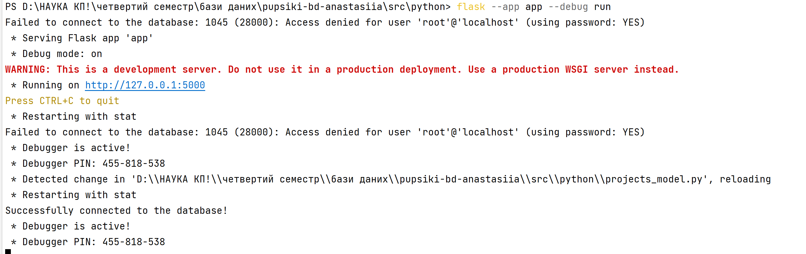
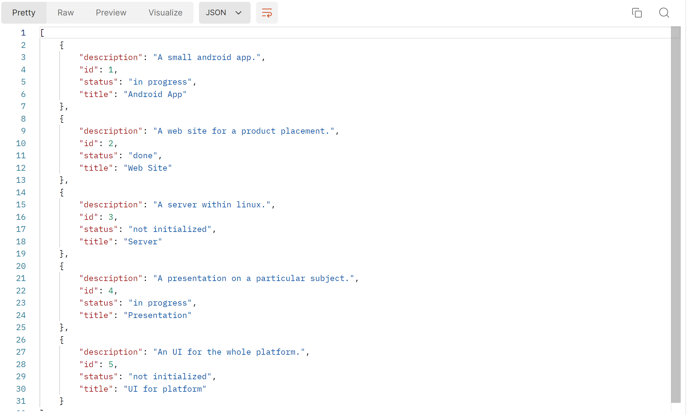
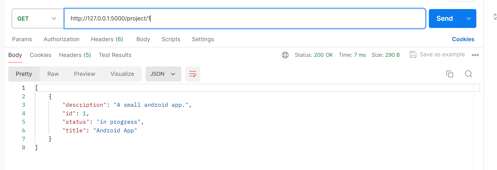
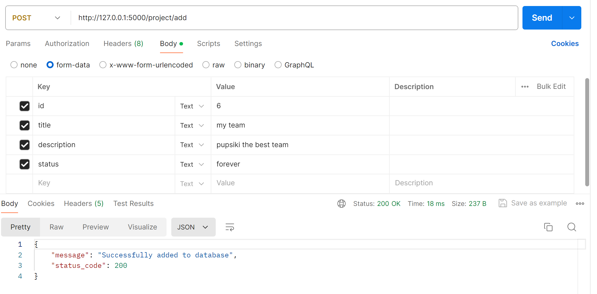
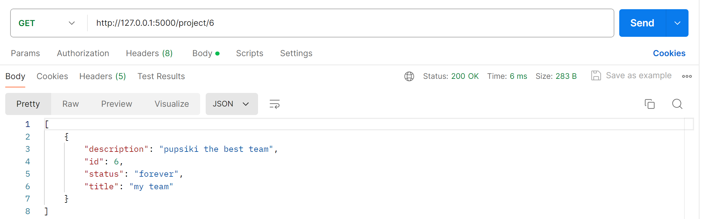
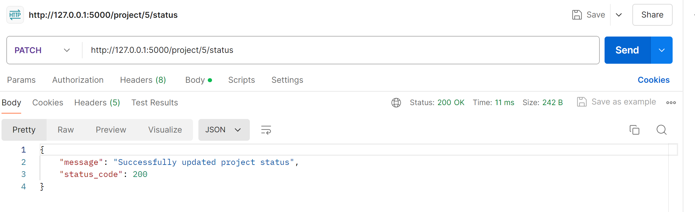
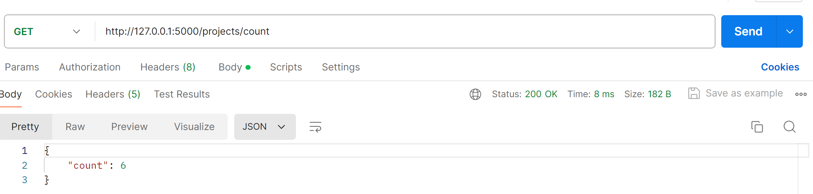
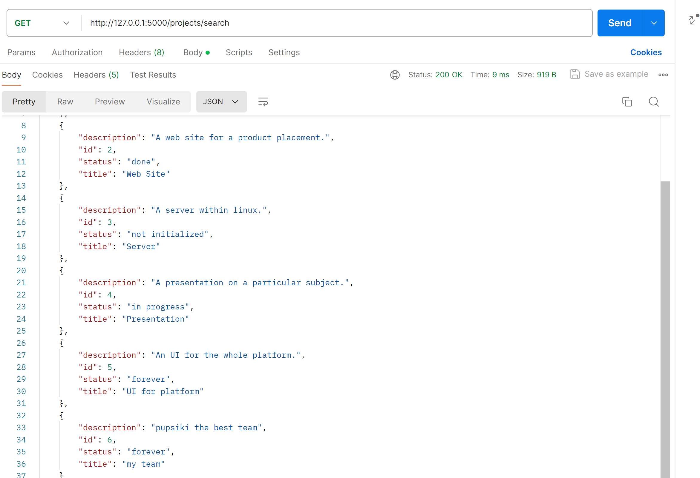
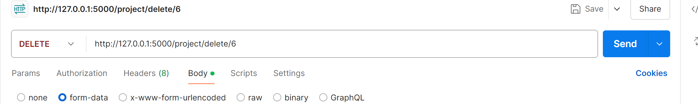
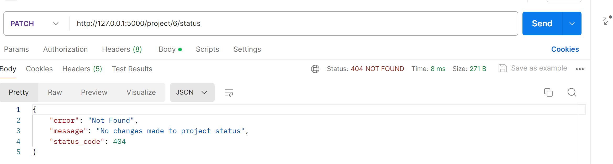

# Тестування працездатності системи
Для тестування системи використовувся додаток Postman
## Запуск сервера
 

## Метод GET

### GET ALL PROJECTS
 
 

### GET PROJECTS BY ID
 

## Метод POST
### POST PROJECT
 
#### Перевірка за допомогою GET
 

## Метод PATCH
### PATCH PROJECT
 
#### Перевірка після додавання
 
#### Запит
 

 ## Метод DELETE
### DELETE PROJECT
#### Відповідь
 

#### Перевірка за допомогою PATCH
 
